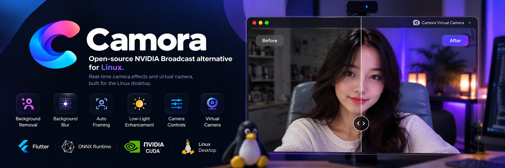

<p align="center">
  
</p>

<h1 align="center">Camora</h1>

<p align="center">
  <strong>Open-source NVIDIA Broadcast alternative for Linux.</strong><br>
  Real-time camera effects and virtual camera, built for the Linux desktop.
</p>

<p align="center">
  
  
  
  
</p>

## What is Camora?

Camora brings NVIDIA Broadcast-like camera features to Linux.

Select your webcam, apply real-time effects, then use **Camora Virtual Camera**
in OBS, Discord, Meet, Zoom, and other supported apps.

```text
Webcam → Camora → Real-time Effects → Virtual Camera → Your Apps
```

## Features

- Background removal
- Background blur
- Background replacement
- Auto framing
- Low-light enhancement
- Dynamic V4L2 camera controls
- Resolution & FPS controls
- NVIDIA CUDA acceleration
- Automatic CPU fallback
- PipeWire virtual camera

Audio enhancement and virtual microphone support are planned.

## Install

> Camora is currently in alpha.

### Ubuntu / Debian

Download the latest `.deb` from **Releases**, then:

```bash
sudo apt install ./camora_<version>_amd64.deb
```

Launch **Camora** from your application menu.

No Flutter, Python, CUDA Toolkit, or development environment is required.

## Build from Source

```bash
git clone <REPOSITORY_URL>
cd camora

flutter pub get
flutter run -d linux
```

Release build:

```bash
flutter build linux --release
```

## How It Works

```text
Physical Camera
      │
      ▼
    Camora
      │
      ├── Background Effects
      ├── Auto Framing
      ├── Low Light
      └── Camera Controls
      │
      ▼
Camora Virtual Camera
      │
      ▼
OBS / Discord / Meet / Zoom
```

Video processing runs locally on your machine.

## GPU Acceleration

Camora uses ONNX Runtime and can automatically use NVIDIA CUDA when available.

If CUDA cannot be initialized, Camora falls back to CPU inference.

Camora is not intended to be NVIDIA-only. Support for additional GPU backends
is planned.

## Tech Stack

**Flutter · C++ · V4L2 · GStreamer · ONNX Runtime · CUDA · PipeWire**

## Roadmap

- [x] Camera controls
- [x] Background removal
- [x] Background blur
- [x] Background replacement
- [x] Auto framing
- [x] Low-light enhancement
- [x] CUDA acceleration
- [x] Virtual camera
- [ ] Production Linux package
- [ ] AMD / Intel acceleration
- [ ] Noise removal
- [ ] Echo reduction
- [ ] Virtual microphone

## Contributing

Camora is under active development.

Bug reports, hardware compatibility reports, fixes, and contributions are welcome.

## License

Camora's final project license is currently being finalized.

Third-party components and bundled runtime libraries remain subject to their
respective licenses. See the included license notices for details.

## Disclaimer

Camora is an independent project and is not affiliated with or endorsed by NVIDIA.

NVIDIA Broadcast and CUDA are trademarks of NVIDIA Corporation.

---

<p align="center">
  <strong>Camora — Your camera. Better. Everywhere.</strong>
</p>